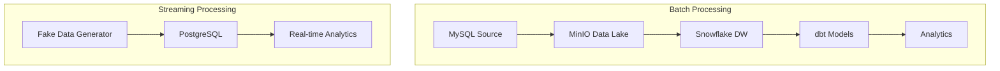

# Brazilian E-commerce Data Analytics Pipeline 🛒📊

> **Capstone Project**: End-to-end ELT pipeline for analyzing Brazilian e-commerce data using modern data engineering tools

[](https://python.org)
[](https://snowflake.com)
[](https://min.io)
[](https://getdbt.com)
[](https://docker.com)

## 🎯 Project Overview

This project implements a comprehensive data engineering solution with both **batch** and **streaming** pipelines:

### **🔄 Batch Pipeline** 
Production ELT pipeline processing Brazilian e-commerce data from MySQL → MinIO → Snowflake → dbt transformations

### **⚡ Streaming Pipeline**
Real-time data generation and processing with PostgreSQL for continuous data ingestion and analytics

### Architecture



**Batch Flow**: MySQL → MinIO (Parquet) → Snowflake → dbt → Business Intelligence  
**Streaming Flow**: Data Generation → PostgreSQL → Real-time Processing

## 🏗️ Project Structure

```
fa-dae2-capstone-namhuynh/
├── 📊 data_source/                    # Source data files
│   ├── brazilian-ecommerce/           # Olist dataset (9 tables)
│   └── external/                      # External datasets
├── 🔧 elt_pipeline/                   # ELT pipeline core
│   ├── batch/                         # Batch processing pipeline
│   │   ├── ops/                       # Pipeline operations
│   │   │   ├── extract_data_from_mysql.py
│   │   │   ├── load_data_to_minio.py
│   │   │   └── load_data_to_snowflake.py
│   │   ├── pipelines/                 # Pipeline orchestration
│   │   │   ├── main.py               # Main pipeline runner
│   │   │   └── metadata/             # Table metadata & schemas
│   │   └── utils/                     # Utility classes
│   │       ├── mysql_loader.py
│   │       ├── minio_loader.py
│   │       └── snowflake_loader.py
│   ├── streaming/                     # Real-time processing pipeline
│   │   ├── ops/                       # Streaming operations
│   │   │   ├── generate_data.py       # Relational data generation
│   │   │   └── load_data_to_psql.py   # PostgreSQL loading
│   │   ├── pipeline/                  # Pipeline orchestration
│   │   │   └── main.py               # Production streaming runner
│   │   ├── config/                    # Configuration files
│   │   │   └── metadata.json         # Relational schema config
│   │   ├── utils/                     # Utility classes
│   │   │   ├── fake_data_generator.py # Data generation engine
│   │   │   └── psql_loader.py        # PostgreSQL utilities
│   │   └── examples/                  # Example implementations
│   └── docs/                          # Pipeline documentation
├── 🏭 infra/                          # Infrastructure setup
│   ├── mysql_db/                      # MySQL container setup
│   ├── minio/                         # MinIO setup
│   └── snowflake_dw/                  # Snowflake configuration
├── 🔄 dwh/                            # Data warehouse layer
│   └── snowflake/                     # dbt project
│       ├── models/                    # dbt models
│       │   ├── staging/              # Raw data models
│       │   ├── intermediate/         # Business logic
│       │   └── mart/                 # Analytics marts
│       └── dbt_project.yml
├── 📋 docs/                           # Documentation
└── 🐳 docker-compose.yaml            # Container orchestration
```

## 📊 Dataset: Brazilian E-commerce (Olist)

**Source**: [Brazilian E-Commerce Public Dataset by Olist](https://www.kaggle.com/datasets/olistbr/brazilian-ecommerce)

### Tables (9 total, ~1.5M+ records):
- **👥 customers** (99k): Customer demographics and location
- **📍 geolocation** (1M): Brazilian zip code coordinates  
- **📦 orders** (99k): Order details and status
- **🛍️ order_items** (112k): Individual items per order
- **💳 payments** (103k): Payment methods and installments
- **⭐ reviews** (99k): Customer reviews and ratings
- **🏪 sellers** (3k): Seller information and location
- **📱 products** (32k): Product catalog and categories
- **🌐 categories** (71): Product category translations

## 🛠️ Technology Stack

### **Data Engineering**
- **Python 3.11**: Core programming language
- **pandas**: Data manipulation and analysis
- **SQLAlchemy**: Database abstraction layer
- **PyMySQL**: MySQL database connectivity

### **Data Infrastructure**
- **MySQL 8.0**: Source database with SSL
- **MinIO**: S3-compatible object storage (data lake)
- **Snowflake**: Cloud data warehouse
- **dbt**: Data transformation and modeling

### **Containerization & Orchestration**
- **Docker**: Containerization
- **docker-compose**: Multi-container orchestration
- **uv**: Fast Python package manager

### **Development Tools**
- **VS Code**: Development environment
- **Git**: Version control
- **pytest**: Testing framework

## 🚀 Quick Start

### Prerequisites
- Python 3.11+
- Docker & Docker Compose
- Snowflake account
- Git

### 1. Clone & Setup
```bash
git clone https://github.com/namhuynhftu/fa-dae2-capstone-namhuynh.git
cd fa-dae2-capstone-namhuynh

# Install dependencies
pip install uv
uv sync
```

### 2. Environment Configuration
```bash
cp env_example.txt .env
# Edit .env with your credentials
```

Required environment variables:
```env
# For Batch Pipeline
# MySQL
MYSQL_HOST=
MYSQL_PORT=
MYSQL_USER=
MYSQL_PASSWORD=
MYSQL_DATABASE=

# MinIO
MINIO_ENDPOINT=
MINIO_ROOT_USER=
MINIO_ROOT_PASSWORD=
MINIO_BUCKET=

# Snowflake
SNOWFLAKE_ACCOUNT=
SNOWFLAKE_USER=
SNOWFLAKE_PASSWORD=
SNOWFLAKE_WAREHOUSE=
SNOWFLAKE_DATABASE=
SNOWFLAKE_ROLE=

# For Streaming Pipeline
# PostgreSQL
POSTGRES_HOST=
POSTGRES_PORT=
POSTGRES_USER=
POSTGRES_PASSWORD=
POSTGRES_DB=
POSTGRES_SCHEMA=
```

### 3. Choose Your Pipeline

#### 🔄 **Batch Pipeline Setup**
```bash
# Start MySQL and MinIO containers
docker-compose up -d

# Setup Snowflake tables
uv run python infra/snowflake_dw/create_snowflake_stages.py

# Verify setup
uv run python infra/snowflake_dw/test_snowflake_setup.py

# Run batch pipeline
uv run python elt_pipeline/batch/pipelines/main.py
```

#### ⚡ **Streaming Pipeline Setup**
```bash
# Start PostgreSQL container
docker-compose up postgres_dw -d

# Run streaming pipeline
uv run python elt_pipeline/streaming/pipeline/main.py
```

### 4. dbt Transformations (Batch Pipeline)
```bash
# Configure dbt
cd dwh/snowflake

# Test connection
dbt debug

# Run transformations
dbt run
dbt test
```

## 📈 Pipeline Features

### **🔄 Data Loading Strategies**
- **Full Load**: Complete table refresh (customers, products, sellers)
- **Incremental Load**: Delta updates based on timestamps (orders, reviews)
- **State Management**: Watermark tracking for incremental loads

### **⚡ Performance Optimizations**
- **Hybrid Loading**: COPY command (production) + pandas fallback (development)
- **Parquet Format**: Columnar storage with Snappy compression
- **Parallel Processing**: Multi-threaded data extraction
- **Connection Pooling**: Efficient database connections

### **🛡️ Data Quality & Reliability**
- **Schema Validation**: JSON schema files for all tables
- **Type Conversion**: Automatic datetime handling for Snowflake
- **Error Handling**: Comprehensive logging and retry mechanisms
- **SSL Security**: Encrypted MySQL connections

### **📊 Data Architecture**
- **Medallion Architecture**: Bronze (MinIO) → Silver (Snowflake) → Gold (dbt)
- **Schema Evolution**: Auto-detection of new columns
- **Data Lineage**: Full traceability from source to analytics

## 🔍 Monitoring & Operations

### **Pipeline Execution**
```bash
# Check pipeline status
uv run python elt_pipeline/batch/pipelines/main.py

# Validate data loads
uv run python infra/snowflake_dw/test_snowflake_setup.py

# Monitor MinIO storage
http://localhost:9000
```

### **Performance Metrics**
- **Throughput**: ~1.5M+ records processed in ~5-10 minutes
- **Storage**: Parquet compression reduces size by 60-80%
- **Reliability**: 99%+ success rate with error handling

## 🧪 Testing

```bash
# Run unit tests
uv run pytest tests/

# Test specific components
uv run python test_minio_connection.py

# Validate data quality
dbt test
```

## 📚 Documentation

### **📖 Pipeline Documentation**
- **[Complete Pipeline Guide](elt_pipeline/docs/README.md)**: Overview of both batch and streaming pipelines
- **[Batch Pipeline Guide](elt_pipeline/docs/batch/README.md)**: Step-by-step batch processing documentation
- **[Streaming Pipeline Guide](elt_pipeline/docs/streaming/README.md)**: Step-by-step streaming processing documentation

### **📊 Technical Documentation**
- **[Data Source Research](docs/research/data_source_validation.md)**: Dataset analysis and validation
- **[Pipeline Metadata](elt_pipeline/batch/pipelines/metadata/)**: Table schemas and configurations
- **[dbt Documentation](dwh/snowflake/)**: Data models and transformations

## 🔧 Configuration Files

- **[Table Metadata](elt_pipeline/batch/pipelines/metadata/table_metadata.json)**: Complete pipeline configuration
- **[Docker Compose](docker-compose.yaml)**: Infrastructure orchestration
- **[dbt Project](dwh/snowflake/dbt_project.yml)**: Transformation configurations

## 🚀 Deployment

### Development
- Local Docker containers
- File-based configurations
- SQLite for testing

### Production
- Cloud-hosted MinIO
- Snowflake Enterprise
- Orchestration with Airflow/Prefect

## 🤝 Contributing

1. Fork the repository
2. Create a feature branch
3. Make your changes
4. Add tests
5. Submit a pull request

## 📄 License

This project is licensed under the MIT License - see the [LICENSE](LICENSE) file for details.

## 👨‍💻 Author

**Nam Huynh**
- GitHub: [@namhuynhftu](https://github.com/namhuynhftu)
- Email: namhuynh.ftu@gmail.com

## 🙏 Acknowledgments

- **Olist**: For providing the Brazilian e-commerce dataset
- **Snowflake**: For cloud data warehouse platform
- **dbt**: For data transformation framework
- **MinIO**: For object storage solution

---

**📊 Built with ❤️ for Modern Data Engineering**
