# Brazilian E-commerce Data Analytics Pipeline 🛒📊

> **DAE2 Capstone Project**: Production-grade end-to-end data engineering solution with AI-powered analytics agent

[](https://python.org)
[](https://snowflake.com)
[](https://min.io)
[](https://getdbt.com)
[](https://docker.com)
[](https://airflow.apache.org)

## 🎯 Project Purpose

This capstone project demonstrates a **production-ready modern data stack** that addresses real-world e-commerce analytics challenges by implementing:

1. **Dual Pipeline Architecture**: Combining batch historical analytics with real-time operational insights
2. **Dimensional Data Modeling**: Star schema optimized for business intelligence and reporting
3. **AI-Powered Analytics**: RAG-based chatbot that converges document knowledge with live data warehouse queries
4. **DevOps Best Practices**: CI/CD automation, data quality testing, and infrastructure as code

### Business Problem
E-commerce platforms need to:
- Analyze historical sales trends and customer behavior (batch)
- Monitor real-time transactions and inventory (streaming)
- Enable non-technical users to query data using natural language (AI agent)
- Ensure data quality and pipeline reliability (testing & orchestration)

This project solves these challenges using a scalable, cloud-native architecture processing **1.5M+ records** from Brazilian e-commerce transactions.

---

## 🏗️ System Architecture

### High-Level Architecture Diagram

```mermaid
graph TB
    subgraph Sources["🔹 Data Sources"]
        MySQL[(MySQL 8.0<br/>Brazilian E-commerce<br/>9 Tables, 1.5M+ rows)]
        KafkaGen[Kafka Producer<br/>Invoice Generator<br/>Real-time Events]
    end
    
    subgraph Batch["🔄 Batch Pipeline - Historical Data"]
        Extract[Extract<br/>Python + SQLAlchemy]
        MinIO[(MinIO S3<br/>Data Lake<br/>Parquet Files)]
        SnowStage[Snowflake Stage<br/>MINIO_STAGE_SHARED]
        SnowRaw[(Snowflake RAW_DATA<br/>9 Tables)]
        
        MySQL -->|pandas DataFrame| Extract
        Extract -->|Parquet + Snappy| MinIO
        MinIO -->|COPY INTO| SnowStage
        SnowStage -->|Load| SnowRaw
    end
    
    subgraph Stream["⚡ Streaming Pipeline - Real-time Data"]
        Kafka[Kafka Topic<br/>invoices]
        Consumer[Kafka Consumer<br/>confluent_kafka]
        PG[(PostgreSQL<br/>streaming_db.invoices)]
        
        KafkaGen -->|JSON Events| Kafka
        Kafka -->|Poll & Consume| Consumer
        Consumer -->|INSERT| PG
    end
    
    subgraph Transform["🔄 Transformation Layer - dbt"]
        Staging[Staging Layer<br/>Raw data cleaned]
        Intermediate[Intermediate Layer<br/>Business logic]
        Mart[Mart Layer<br/>6 Dimensions + 4 Facts]
        
        SnowRaw -->|dbt models| Staging
        Staging -->|Joins & enrichment| Intermediate
        Intermediate -->|Star schema| Mart
    end
    
    subgraph Orchestration["⚙️ Orchestration & Quality"]
        Airflow[Apache Airflow<br/>4 Tasks DAG]
        DBT_Tests[dbt Tests<br/>Generic + Singular]
        CI[GitHub Actions<br/>SQLFluff + dbt CI]
        
        Airflow -->|Schedule & monitor| Batch
        Airflow -->|Trigger| Transform
        Transform -->|Run tests| DBT_Tests
        CI -->|PR validation| Transform
    end
    
    subgraph AI["🤖 AI Analytics Agent"]
        CLI[CLI Interface<br/>Conversation Memory]
        RAG[RAG System<br/>ChromaDB + OpenAI]
        SQLRunner[SQL Query Engine<br/>Snowflake + PostgreSQL]
        Agent[LangChain Agent<br/>Query Classification]
        
        CLI --> Agent
        Agent -->|Document queries| RAG
        Agent -->|Data queries| SQLRunner
        SQLRunner -->|Batch data| Mart
        SQLRunner -->|Real-time data| PG
    end
    
    classDef source fill:#e1f5ff,stroke:#01579b,stroke-width:2px
    classDef batch fill:#fff3e0,stroke:#e65100,stroke-width:2px
    classDef stream fill:#f3e5f5,stroke:#4a148c,stroke-width:2px
    classDef transform fill:#e8f5e9,stroke:#1b5e20,stroke-width:2px
    classDef orchestration fill:#fce4ec,stroke:#880e4f,stroke-width:2px
    classDef ai fill:#fff9c4,stroke:#f57f17,stroke-width:2px
    
    class MySQL,KafkaGen source
    class Extract,MinIO,SnowStage,SnowRaw batch
    class Kafka,Consumer,PG stream
    class Staging,Intermediate,Mart transform
    class Airflow,DBT_Tests,CI orchestration
    class CLI,RAG,SQLRunner,Agent ai
```



### Data Flow Summary

| Pipeline | Latency | Volume | Storage | Use Case |
|----------|---------|--------|---------|----------|
| **Batch** | Daily (2 AM) | 1.5M+ rows | MinIO → Snowflake | Historical analytics, trends, BI dashboards |
| **Streaming** | < 5 minutes | ~100 events/min | PostgreSQL | Real-time monitoring, operational metrics |
| **AI Agent** | < 2 seconds | N/A | ChromaDB + LLM | Natural language queries, hybrid analytics |

---

## 🎨 Key Design Decisions

### 1. **Medallion Architecture with MinIO Data Lake**
**Decision**: Use MinIO as an intermediate data lake layer before Snowflake.

**Rationale**:
- **Cost Optimization**: Snowflake charges for data ingestion; MinIO provides free S3-compatible storage
- **Disaster Recovery**: Parquet files in MinIO serve as backup and enable replay
- **Data Validation**: Allows inspection of raw data before warehouse load
- **Format Standardization**: Converts CSV to Parquet with Snappy compression (60-80% size reduction)

**Trade-offs**: Added complexity vs. cost savings for large-scale data

### 2. **Dimensional Modeling (Star Schema)**
**Decision**: Implement Kimball-style star schema with conformed dimensions.

**Rationale**:
- **Query Performance**: Denormalized structure optimized for analytical queries
- **Business Alignment**: Dimensions (customer, product, date) match business terminology
- **Scalability**: Incremental fact loading supports growing data volumes
- **BI Tool Compatibility**: Standard star schema works with Tableau, Power BI, Looker

**Implementation**: 6 dimensions + 4 fact tables (see [ERD.md](docs/ERD.md))

### 3. **Incremental dbt Models with Merge Strategy**
**Decision**: Use `incremental_strategy='merge'` for fact tables instead of full refresh.

**Rationale**:
- **Performance**: Only processes new/changed records (based on `max(purchase_date)`)
- **Cost Efficiency**: Reduces Snowflake compute credits
- **Late Arriving Facts**: Merge strategy handles out-of-order data

**Code Example**:
```sql

  and purchase_date >= (select max(purchase_date) from {{ this }})

```

### 4. **Kafka for Streaming (Not Debezium CDC)**
**Decision**: Use Kafka producer/consumer for streaming instead of CDC from MySQL.

**Rationale**:
- **Simplicity**: Direct Kafka integration easier to maintain than Debezium connectors
- **Data Generation**: Fake data generator simulates real-time events for demo
- **Decoupling**: Separates batch (historical) from streaming (operational) concerns
- **Latency Requirements**: Kafka meets < 5 minute latency requirement

**Trade-off**: Not true CDC, but sufficient for analytics use case

### 5. **Hybrid AI Agent (RAG + SQL)**
**Decision**: Build unified agent that routes queries to either RAG system or SQL engine.

**Rationale**:
- **Unified Interface**: Single CLI for documents + data warehouse queries
- **Context Awareness**: LLM classifies query intent (document/batch/streaming/hybrid)
- **Conversation Memory**: Maintains context across multi-turn conversations
- **Production Ready**: Uses LangChain for agent orchestration and OpenAI for embeddings

**Architecture**: 
- RAG: ChromaDB vector store → retrieves documentation chunks
- SQL: Generates queries for Snowflake (batch) or PostgreSQL (streaming)
- Hybrid: Combines both results in LLM-synthesized response

### 6. **Airflow for Orchestration**
**Decision**: Use Airflow DAG with 4 tasks instead of manual Python scripts.

**Rationale**:
- **Observability**: Task-level monitoring and logging
- **Retry Logic**: Automatic retries on transient failures
- **Scheduling**: Cron-based daily execution
- **Dependency Management**: Clear task dependencies (validate → extract → cleanup → transform)

**DAG Structure**:
```
validate_connections → extract_and_load_pipeline → cleanup_and_validate_data → dbt_build
```

### 7. **CI/CD with GitHub Actions**
**Decision**: Automate dbt testing and SQL linting on every PR.

**Rationale**:
- **Quality Gates**: Prevent merging code that fails tests
- **Fast Feedback**: Developers know about issues within minutes
- **Consistency**: SQLFluff ensures consistent SQL formatting
- **Cost Control**: Tests run in CI environment (separate from production Snowflake)

**Checks**: SQLFluff lint → dbt compile → dbt test (20+ data quality tests)

---

## 🏗️ Project Structure

```
fa-dae2-capstone-namhuynh/
├── 📊 data_source/                    # Source data files
│   ├── brazilian-ecommerce/           # Olist dataset (9 tables)
│   └── external/                      # External datasets
├── 🔧 elt_pipeline/                   # ELT pipeline core
│   ├── batch/                         # Batch processing pipeline
│   │   ├── ops/                       # Pipeline operations
│   │   │   ├── extract_data_from_mysql.py
│   │   │   ├── load_data_to_minio.py
│   │   │   └── load_data_to_snowflake.py
│   │   ├── pipelines/                 # Pipeline orchestration
│   │   │   ├── main.py               # Main pipeline runner
│   │   │   └── metadata/             # Table metadata & schemas
│   │   └── utils/                     # Utility classes
│   │       ├── mysql_loader.py
│   │       ├── minio_loader.py
│   │       └── snowflake_loader.py
│   ├── streaming/                     # Real-time processing pipeline
│   │   ├── ops/                       # Streaming operations
│   │   │   ├── generate_data.py       # Relational data generation
│   │   │   └── load_data_to_psql.py   # PostgreSQL loading
│   │   ├── pipeline/                  # Pipeline orchestration
│   │   │   └── main.py               # Production streaming runner
│   │   ├── config/                    # Configuration files
│   │   │   └── metadata.json         # Relational schema config
│   │   ├── utils/                     # Utility classes
│   │   │   ├── fake_data_generator.py # Data generation engine
│   │   │   └── psql_loader.py        # PostgreSQL utilities
│   │   └── examples/                  # Example implementations
│   └── docs/                          # Pipeline documentation
├── 🏭 infra/                          # Infrastructure setup
│       ├── mysql_db/                      # MySQL container setup
│       ├── minio/                         # MinIO setup
│       └── snowflake_dw/                  # Snowflake configuration
├── 🔄 dwh/                            # Data warehouse layer
│   └── snowflake/                     # dbt project
│       ├── models/                    # dbt models
│       │   ├── staging/              # Raw data models
│       │   ├── intermediate/         # Business logic
│       │   └── mart/                 # Analytics marts
│       └── dbt_project.yml
├── 📋 docs/                           # Documentation
└── 🐳 docker-compose.yaml            # Container orchestration
```

## 📊 Dataset: Brazilian E-commerce (Olist)

**Source**: [Brazilian E-Commerce Public Dataset by Olist](https://www.kaggle.com/datasets/olistbr/brazilian-ecommerce)

### Tables (9 total, ~1.5M+ records):
- **👥 customers** (99k): Customer demographics and location
- **📍 geolocation** (1M): Brazilian zip code coordinates  
- **📦 orders** (99k): Order details and status
- **🛍️ order_items** (112k): Individual items per order
- **💳 payments** (103k): Payment methods and installments
- **⭐ reviews** (99k): Customer reviews and ratings
- **🏪 sellers** (3k): Seller information and location
- **📱 products** (32k): Product catalog and categories
- **🌐 categories** (71): Product category translations

## 🛠️ Technology Stack

### **Data Engineering**
- **Python 3.11**: Core programming language
- **pandas**: Data manipulation and analysis
- **SQLAlchemy**: Database abstraction layer
- **PyMySQL**: MySQL database connectivity

### **Data Infrastructure**
- **MySQL 8.0**: Source database with SSL
- **MinIO**: S3-compatible object storage (data lake)
- **Snowflake**: Cloud data warehouse
- **dbt**: Data transformation and modeling

### **Containerization & Orchestration**
- **Docker**: Containerization
- **docker-compose**: Multi-container orchestration
- **uv**: Fast Python package manager

### **Development Tools**
- **VS Code**: Development environment
- **Git**: Version control
- **pytest**: Testing framework

## 🚀 Setup Instructions

### Prerequisites

| Tool | Version | Purpose |
|------|---------|---------|
| Python | 3.11+ | Core language |
| Docker | 24.0+ | Containerization |
| Docker Compose | 2.20+ | Multi-container orchestration |
| Git | 2.40+ | Version control |
| Snowflake Account | N/A | Cloud data warehouse |
| OpenAI API Key | N/A | AI agent embeddings & LLM |
| uv | 0.5+ | Fast Python package manager |

### Step 1: Clone Repository

```bash
git clone https://github.com/namhuynhftu/fa-dae2-capstone-namhuynh.git
cd fa-dae2-capstone-namhuynh
```

### Step 2: Install Python Dependencies

```bash
# Install uv (if not already installed)
pip install uv

# Install all project dependencies
uv sync

# Verify installation
uv run python --version  # Should show Python 3.11+
```

### Step 3: Configure Environment Variables

```bash
# Create config directory structure (already exists in repo)
# Edit config files with your credentials

# For batch pipeline - edit this file:
config/app/development.env
```

**Required Environment Variables** (`config/app/development.env`):

```env
# ========== MySQL Source Database ==========
MYSQL_HOST=your-mysql-host
MYSQL_PORT=3306
MYSQL_USER=your-user
MYSQL_PASSWORD=your-password
MYSQL_DATABASE=brazilian_ecommerce

# ========== MinIO Data Lake ==========
MINIO_ENDPOINT=localhost:9000
MINIO_ROOT_USER=minioadmin
MINIO_ROOT_PASSWORD=minioadmin
MINIO_BUCKET=data-lake

# ========== Snowflake Data Warehouse ==========
SNOWFLAKE_ACCOUNT=your-account.region
SNOWFLAKE_USER=your-user
SNOWFLAKE_PRIVATE_KEY_FILE_PATH=/path/to/snowflake_key.p8
SNOWFLAKE_PRIVATE_KEY_FILE_PWD=your-key-password
SNOWFLAKE_WAREHOUSE=COMPUTE_WH
SNOWFLAKE_DATABASE=DB_T25
SNOWFLAKE_ROLE=ACCOUNTADMIN
SNOWFLAKE_SCHEMA=RAW_DATA

# ========== PostgreSQL (Streaming) ==========
POSTGRES_HOST=localhost
POSTGRES_PORT=5432
POSTGRES_USER=postgres
POSTGRES_PASSWORD=postgres
POSTGRES_DB=streaming_db
POSTGRES_SCHEMA=kafka_streaming

# ========== OpenAI API (AI Agent) ==========
OPENAI_API_KEY=sk-proj-...your-key...

# ========== AI Agent Paths ==========
DOCUMENTS_PATH=./ai_agent/documents
VECTOR_STORE_PATH=./ai_agent/vector_store
```

### Step 4: Setup Infrastructure

#### 4.1 Start Docker Containers

```bash
# Start MySQL source database and MinIO
docker-compose up -d mysql_db minio_storage

# Start PostgreSQL for streaming
docker-compose up -d postgres_dw

# Verify containers are running
docker ps
```

#### 4.2 Initialize Snowflake

```bash
# Create Snowflake schemas and stages
uv run python infra/snowflake_dw/create_snowflake_stages.py

# Verify Snowflake setup
uv run python infra/snowflake_dw/test_snowflake_setup.py
```

#### 4.3 Setup dbt

```bash
cd dwh/snowflake

# Install dbt dependencies
uv run dbt deps

# Test Snowflake connection
uv run dbt debug

# Go back to project root
cd ../..
```

### Step 5: Setup Airflow (Optional - for orchestration)

```bash
# Start Airflow services
docker compose -f docker/docker-compose.airflow.yml -p airflow up -d

# Wait for Airflow to initialize (30-60 seconds)
# Access Airflow UI at http://localhost:8080
# Default credentials: airflow / airflow

# Setup connections
cd airflow
bash setup_mysql_connection.sh
bash setup_minio_connection.sh
bash setup_snowflake_connection.sh
```

---

## ▶️ How to Run

### Option 1: Run Individual Pipelines (Manual)

#### **A. Batch Pipeline (Historical Data)**

```bash
# Run complete batch pipeline
uv run python elt_pipeline/batch/pipelines/main.py

# This � Architecture & Design**
- **[ERD Diagram](docs/ERD.md)**: Complete data model with staging → intermediate → mart layers
- **[Architecture Overview](#-system-architecture)**: High-level system diagram (see above)
- **[Key Design Decisions](#-key-design-decisions)**: Rationale for technology choices

### **📖 Pipeline Documentation**
- **[Complete Pipeline Guide](elt_pipeline/docs/README.md)**: Overview of both batch and streaming pipelines
- **[Batch Pipeline Guide](elt_pipeline/docs/batch/README.md)**: Step-by-step batch processing documentation
- **[Streaming Pipeline Guide](elt_pipeline/docs/streaming/README.md)**: Step-by-step streaming processing documentation

### **📊 Technical Documentation**
- **[Data Source Research](docs/research/data_source_validation.md)**: Dataset analysis and validation
- **[Pipeline Metadata](elt_pipeline/batch/pipelines/metadata/)**: Table schemas and configurations
- **[dbt Documentation](dwh/snowflake/)**: Data models and transformations

### **🤖 AI Agent Documentation**
- **[AI Agent Services](ai_agent/services/)**: RAG retriever, SQL runner, embeddings
- **[CLI Usage](ai_agent/cli.py)**: Command-line interface for chatbot
#### **B. dbt Transformations**

```bash
cd dwh/snowflake

# Run all models (staging → intermediate → mart)
uv run dbt run

# Run incremental models only
uv run dbt run --select fact_order_items fact_reviews fact_orders_accumulating

# Run data quality tests
uv run dbt test

# Generate and serve documentation
uv run dbt docs generate
uv run dbt docs serve
```

#### **C. Streaming Pipeline (Real-time)**

```bash
# Terminal 1: Start Kafka producer (generates fake invoice data)
docker compose -f docker/docker-compose.streaming.yml up -d kafka zookeeper
uv run python kafka/producer.py

# Terminal 2: Start Kafka consumer (writes to PostgreSQL)
uv run python kafka/consumer.py

# Monitor PostgreSQL data
uv run python -c "
from kafka.database import get_postgres_dsn
import psycopg2
conn = psycopg2.connect(get_postgres_dsn())
cur = conn.cursor()
cur.execute('SELECT COUNT(*) FROM kafka_streaming.invoices')
print(f'Total invoices: {cur.fetchone()[0]}')
"
```

#### **D. AI Analytics Agent**

```bash
# Index documents into vector store (one-time setup)
uv run python ai_agent/index_documents.py

# Start CLI chatbot
uv run python ai_agent/cli.py

# Example queries:
# - "How many customers are in the warehouse?"           (Snowflake query)
# - "Show me the latest 5 invoices"                      (PostgreSQL query)
# - "According to my resume, what is my previous job?"   (RAG document query)
# - "According to documentation, what tables exist in ANALYTICS schema? Show me row counts." (Hybrid query)
```

### Option 2: Run with Airflow (Orchestrated)

```bash
# Access Airflow UI at http://localhost:8080

# Enable the DAG: e2e_batch_elt_pipeline
# Trigger manually or wait for scheduled run (daily at 2 AM)

# DAG executes 4 tasks:
# 1. validate_connections - Check MySQL, MinIO, Snowflake connectivity
# 2. extract_and_load_pipeline - Run batch ETL
# 3. cleanup_and_validate_data - Clean Snowflake stages, validate row counts
# 4. dbt_build - Run dbt transformations and tests

# Monitor task logs in Airflow UI
```

### Option 3: Run Tests

```bash
# Run dbt data quality tests
cd dwh/snowflake
uv run dbt test

# Expected output:
# - Generic tests: unique, not_null constraints (20+ tests)
# - Singular tests: business logic validation (2 custom tests)

# Run Python unit tests (if implemented)
cd ../..
uv run pytest tests/
```

---

## 📊 Expected Results

### Batch Pipeline Success Indicators

```
✅ MySQL extraction: 9 tables, 1.5M+ rows
✅ MinIO storage: 9 Parquet files in data-lake bucket
✅ Snowflake RAW_DATA: 9 tables loaded
✅ dbt transformations: 6 dimensions + 4 facts created
✅ dbt tests: All passed (0 failures)
```

### Streaming Pipeline Success Indicators

```
✅ Kafka producer: Generating ~100 events/minute
✅ Kafka consumer: Reading and inserting to PostgreSQL
✅ PostgreSQL: Invoices table growing continuously
✅ Latency: < 5 minutes from generation to database
```

### AI Agent Success Indicators

```
✅ Vector store: 6+ document chunks indexed
✅ Query classification: Correct routing (document/batch/streaming/hybrid)
✅ Conversation memory: Context preserved across turns
✅ Response time: < 2 seconds for typical queries
```

---

## 📈 Pipeline Features

### **🔄 Data Loading Strategies**
- **Full Load**: Complete table refresh (customers, products, sellers)
- **Incremental Load**: Delta updates based on timestamps (orders, reviews)
- **State Management**: Watermark tracking for incremental loads

### **⚡ Performance Optimizations**
- **Hybrid Loading**: COPY command (production) + pandas fallback (development)
- **Parquet Format**: Columnar storage with Snappy compression
- **Parallel Processing**: Multi-threaded data extraction
- **Connection Pooling**: Efficient database connections

### **🛡️ Data Quality & Reliability**
- **Schema Validation**: JSON schema files for all tables
- **Type Conversion**: Automatic datetime handling for Snowflake
- **Error Handling**: Comprehensive logging and retry mechanisms
- **SSL Security**: Encrypted MySQL connections

### **📊 Data Architecture**
- **Medallion Architecture**: Bronze (MinIO) → Silver (Snowflake) → Gold (dbt)
- **Schema Evolution**: Auto-detection of new columns
- **Data Lineage**: Full traceability from source to analytics

## 🔍 Monitoring & Operations

### **Pipeline Execution**
```bash
# Check pipeline status
uv run python elt_pipeline/batch/pipelines/main.py

# Validate data loads
uv run python infra/snowflake_dw/test_snowflake_setup.py

# Monitor MinIO storage
http://localhost:9000
```

### **Performance Metrics**
- **Throughput**: ~1.5M+ records processed in ~5-10 minutes
- **Storage**: Parquet compression reduces size by 60-80%
- **Reliability**: 99%+ success rate with error handling

## 🧪 Testing

```bash
# Run unit tests
uv run pytest tests/

# Test specific components
uv run python test_minio_connection.py

# Validate data quality
dbt test
```

## 📚 Documentation

### **📖 Pipeline Documentation**
- **[Complete Pipeline Guide](elt_pipeline/docs/README.md)**: Overview of both batch and streaming pipelines
- **[Batch Pipeline Guide](elt_pipeline/docs/batch/README.md)**: Step-by-step batch processing documentation
- **[Streaming Pipeline Guide](elt_pipeline/docs/streaming/README.md)**: Step-by-step streaming processing documentation

### **📊 Technical Documentation**
- **[Data Source Research](docs/research/data_source_validation.md)**: Dataset analysis and validation
- **[Pipeline Metadata](elt_pipeline/batch/pipelines/metadata/)**: Table schemas and configurations
- **[dbt Documentation](dwh/snowflake/)**: Data models and transformations

## 🔧 Configuration Files

- **[Table Metadata](elt_pipeline/batch/pipelines/metadata/table_metadata.json)**: Complete pipeline configuration
- **[Docker Compose](docker-compose.yaml)**: Infrastructure orchestration
- **[dbt Project](dwh/snowflake/dbt_project.yml)**: Transformation configurations

## 🚀 Deployment

### Development
- Local Docker containers
- File-based configurations
- SQLite for testing

### Production
- Cloud-hosted MinIO
- Snowflake Enterprise
- Orchestration with Airflow/Prefect

## 🤝 Contributing

1. Fork the repository
2. Create a feature branch
3. Make your changes
4. Add tests
5. Submit a pull request

## 📄 License

This project is licensed under the MIT License - see the [LICENSE](LICENSE) file for details.

## 👨‍💻 Author

**Nam Huynh**
- GitHub: [@namhuynhftu](https://github.com/namhuynhftu)
- Email: namhuynh.ftu@gmail.com

## 🙏 Acknowledgments

- **Olist**: For providing the Brazilian e-commerce dataset
- **Snowflake**: For cloud data warehouse platform
- **dbt**: For data transformation framework
- **MinIO**: For object storage solution

---

**📊 Built with ❤️ for Modern Data Engineering**
