# Entity Relationship Diagram (ERD) 📊

## Data Model Overview

This document provides a comprehensive view of the **dimensional data model** implemented in Snowflake using dbt. The model follows **Kimball methodology** with a star schema optimized for analytical queries.

---

## Model Architecture Layers

```
┌─────────────────────────────────────────────────────────────┐
│                    STAGING LAYER                            │
│              (Raw data from MySQL source)                   │
│                                                             │
│  stg_customers │ stg_geolocation │ stg_orders │ stg_order_items │
│  stg_payments  │ stg_reviews     │ stg_sellers │ stg_products   │
│  stg_categories                                              │
└─────────────────────────┬───────────────────────────────────┘
                          │
                          ▼
┌─────────────────────────────────────────────────────────────┐
│               INTERMEDIATE LAYER                            │
│          (Business logic & enrichment)                      │
│                                                             │
│  int_customers_geocoded   │ int_sellers_geocoded            │
│  int_products_cleaned     │ int_order_items_enriched        │
│  int_orders_with_status   │ int_payments_aggregated         │
│  int_reviews_sentiment                                      │
└─────────────────────────┬───────────────────────────────────┘
                          │
                          ▼
┌─────────────────────────────────────────────────────────────┐
│                    MART LAYER                               │
│              (Star Schema - Analytics Ready)                │
│                                                             │
│  ┌──────────────┐          ┌──────────────┐                │
│  │  DIMENSIONS  │          │    FACTS     │                │
│  ├──────────────┤          ├──────────────┤                │
│  │ dim_customer │──────────│ fact_orders  │                │
│  │ dim_product  │──────────│ fact_order_  │                │
│  │ dim_seller   │          │   items      │                │
│  │ dim_geography│          │ fact_payments│                │
│  │ dim_payment_ │──────────│ fact_reviews │                │
│  │   type       │                                           │
│  │ dim_date     │                                           │
│  └──────────────┘                                           │
└─────────────────────────────────────────────────────────────┘
```

---

## Complete ERD - Star Schema

```mermaid
erDiagram
    %% ============================================================
    %% DIMENSIONS
    %% ============================================================
    
    DIM_CUSTOMER {
        string customer_key PK "Surrogate key"
        string customer_id UK "Business key"
        string customer_unique_id "Unique across platform"
        string customer_zip_code_prefix
        string customer_city
        string customer_state
        float customer_lat "Joined from geolocation"
        float customer_lng "Joined from geolocation"
    }
    
    DIM_PRODUCT {
        string product_key PK "Surrogate key"
        string product_id UK "Business key"
        string product_category_name
        string product_category_name_english "Translated"
        float product_name_length
        float product_description_length
        float product_photos_qty
        float product_weight_g
        float product_length_cm
        float product_height_cm
        float product_width_cm
    }
    
    DIM_SELLER {
        string seller_key PK "Surrogate key"
        string seller_id UK "Business key"
        string seller_zip_code_prefix
        string seller_city
        string seller_state
        float seller_lat "Joined from geolocation"
        float seller_lng "Joined from geolocation"
    }
    
    DIM_GEOGRAPHY {
        string geography_key PK "Surrogate key"
        string zip_code_prefix
        string city
        string state
        float lat
        float lng
    }
    
    DIM_PAYMENT_TYPE {
        string payment_type_key PK "Surrogate key"
        string payment_type UK "Business key (credit_card, boleto, etc.)"
        string payment_category "Categorized type"
    }
    
    DIM_DATE {
        date date_key PK "YYYY-MM-DD"
        int year
        int quarter
        int month
        int month_name
        int day
        int day_of_week
        string day_name
        int week_of_year
        boolean is_weekend
        boolean is_holiday
    }
    
    %% ============================================================
    %% FACT TABLES
    %% ============================================================
    
    FACT_ORDER_ITEMS {
        string order_item_key PK "Surrogate key"
        string order_id FK
        int order_item_id
        string customer_key FK "Reference to DIM_CUSTOMER"
        string seller_key FK "Reference to DIM_SELLER"
        string product_key FK "Reference to DIM_PRODUCT"
        date purchase_date FK "Reference to DIM_DATE"
        date delivered_date FK "Reference to DIM_DATE"
        float price "Item unit price"
        float freight_value "Shipping cost"
        float total_item_value "price + freight_value"
    }
    
    FACT_ORDERS_ACCUMULATING {
        string order_key PK "Surrogate key"
        string order_id UK "Business key"
        string customer_key FK "Reference to DIM_CUSTOMER"
        date purchase_date FK "Reference to DIM_DATE"
        date approved_date FK
        date delivered_carrier_date FK
        date delivered_date FK
        date estimated_delivery_date FK
        string order_status "delivered, shipped, canceled, etc."
        int days_to_approve "Calculated metric"
        int days_to_carrier "Calculated metric"
        int days_to_deliver "Calculated metric"
        int days_vs_estimate "Calculated metric"
    }
    
    FACT_PAYMENTS {
        string payment_key PK "Surrogate key"
        string order_id FK
        string payment_type_key FK "Reference to DIM_PAYMENT_TYPE"
        int payment_sequential "Payment installment number"
        int payment_installments "Total installments"
        float payment_value "Payment amount"
    }
    
    FACT_REVIEWS {
        string review_key PK "Surrogate key"
        string review_id UK "Business key"
        string order_id FK
        string customer_key FK "Reference to DIM_CUSTOMER"
        int review_score "1-5 rating"
        string review_comment_title
        string review_comment_message
        date review_creation_date FK "Reference to DIM_DATE"
        date review_answer_timestamp FK
    }
    
    %% ============================================================
    %% RELATIONSHIPS
    %% ============================================================
    
    %% FACT_ORDER_ITEMS relationships
    FACT_ORDER_ITEMS }o--|| DIM_CUSTOMER : "has"
    FACT_ORDER_ITEMS }o--|| DIM_SELLER : "sold by"
    FACT_ORDER_ITEMS }o--|| DIM_PRODUCT : "contains"
    FACT_ORDER_ITEMS }o--|| DIM_DATE : "purchased on"
    
    %% FACT_ORDERS_ACCUMULATING relationships
    FACT_ORDERS_ACCUMULATING }o--|| DIM_CUSTOMER : "placed by"
    FACT_ORDERS_ACCUMULATING }o--|| DIM_DATE : "purchased on"
    
    %% FACT_PAYMENTS relationships
    FACT_PAYMENTS }o--|| DIM_PAYMENT_TYPE : "paid with"
    FACT_PAYMENTS }o--|| FACT_ORDERS_ACCUMULATING : "payment for"
    
    %% FACT_REVIEWS relationships
    FACT_REVIEWS }o--|| DIM_CUSTOMER : "written by"
    FACT_REVIEWS }o--|| FACT_ORDERS_ACCUMULATING : "review for"
    FACT_REVIEWS }o--|| DIM_DATE : "created on"
    
    %% FACT_ORDER_ITEMS to FACT_ORDERS_ACCUMULATING (same order_id)
    FACT_ORDER_ITEMS }o--|| FACT_ORDERS_ACCUMULATING : "belongs to order"
```



---

## Table Descriptions & Business Logic

### 📦 **Fact Tables** (Metrics & Measures)

#### 1. **FACT_ORDER_ITEMS** (Incremental ⚡)
**Purpose**: Line-item details for each product in an order. Primary table for revenue analysis.

**Grain**: One row per order item (order_id + order_item_id)

**Key Metrics**:
- `price`: Product unit price
- `freight_value`: Shipping cost per item
- `total_item_value`: Total = price + freight_value

**Incremental Logic**:
```sql

  and purchase_date >= (select max(purchase_date) from {{ this }})

```

**Business Questions Answered**:
- What are the top-selling products?
- Which sellers generate the most revenue?
- What is the average order value by customer segment?

---

#### 2. **FACT_ORDERS_ACCUMULATING** (Incremental ⚡)
**Purpose**: Order lifecycle tracking from purchase to delivery. Snapshot fact table.

**Grain**: One row per order (order_id)

**Key Dates** (Accumulating Snapshot):
- `purchase_date`: Order placed
- `approved_date`: Payment approved
- `delivered_carrier_date`: Shipped
- `delivered_date`: Delivered to customer
- `estimated_delivery_date`: Expected delivery

**Calculated Metrics**:
- `days_to_approve`: approved_date - purchase_date
- `days_to_carrier`: delivered_carrier_date - approved_date
- `days_to_deliver`: delivered_date - delivered_carrier_date
- `days_vs_estimate`: delivered_date - estimated_delivery_date

**Business Questions Answered**:
- What is the average delivery time?
- How many orders are delayed vs. estimate?
- What is the conversion rate from purchase to approval?

---

#### 3. **FACT_PAYMENTS** (Incremental ⚡)
**Purpose**: Payment details including installments and payment methods.

**Grain**: One row per payment installment (order_id + payment_sequential)

**Key Metrics**:
- `payment_value`: Amount paid
- `payment_installments`: Total number of installments
- `payment_sequential`: Current installment number

**Business Questions Answered**:
- What percentage of payments use credit cards vs. boleto?
- What is the average installment count per order?
- How much revenue is paid in installments vs. full payment?

---

#### 4. **FACT_REVIEWS** (Incremental ⚡)
**Purpose**: Customer review ratings and comments.

**Grain**: One row per review (review_id)

**Key Metrics**:
- `review_score`: 1-5 star rating
- `review_comment_title`: Review title
- `review_comment_message`: Full review text

**Business Questions Answered**:
- What is the average review score by product category?
- Which sellers have the lowest ratings?
- How does delivery time impact review scores?

---

### 🔑 **Dimension Tables** (Descriptive Attributes)

#### 1. **DIM_CUSTOMER**
**Purpose**: Customer demographics and location data.

**Type**: Type 1 SCD (overwrites changes)

**Key Attributes**:
- `customer_key`: Surrogate key (dbt_utils.generate_surrogate_key)
- `customer_id`: Business key from source
- `customer_lat/lng`: Joined from geolocation table

**Usage**: Segment customers by geography, analyze customer lifetime value

---

#### 2. **DIM_PRODUCT**
**Purpose**: Product catalog with category translations and physical dimensions.

**Type**: Type 1 SCD

**Key Attributes**:
- `product_category_name_english`: Translated from Portuguese
- `product_weight_g, product_length_cm, etc.`: Physical dimensions for logistics

**Usage**: Product performance analysis, category trends, shipping cost modeling

---

#### 3. **DIM_SELLER**
**Purpose**: Seller information and location.

**Type**: Type 1 SCD

**Key Attributes**:
- `seller_lat/lng`: Joined from geolocation
- `seller_state`: State for regional analysis

**Usage**: Seller performance metrics, regional seller concentration

---

#### 4. **DIM_GEOGRAPHY**
**Purpose**: Brazilian zip code geographic coordinates.

**Type**: Type 1 SCD

**Key Attributes**:
- `zip_code_prefix`: 5-digit Brazilian ZIP code
- `lat/lng`: Coordinates for mapping

**Usage**: Heatmaps, distance calculations, regional demand analysis

---

#### 5. **DIM_PAYMENT_TYPE**
**Purpose**: Payment method categorization.

**Type**: Type 1 SCD

**Key Attributes**:
- `payment_type`: credit_card, boleto, debit_card, voucher
- `payment_category`: Grouped categories for analysis

**Usage**: Payment method trends, fraud detection, regional payment preferences

---

#### 6. **DIM_DATE**
**Purpose**: Calendar dimension for time-series analysis.

**Type**: Static (pre-populated)

**Key Attributes**:
- `year, quarter, month, week_of_year`
- `day_name`: Monday, Tuesday, etc.
- `is_weekend`: Boolean flag
- `is_holiday`: Brazilian holidays (optional)

**Usage**: Year-over-year comparisons, seasonality analysis, day-of-week trends

---

## Incremental Strategy Details

### Why Incremental Models?

**Problem**: Full refresh of fact tables with millions of rows is:
- **Slow**: Re-processing all data takes 10+ minutes
- **Expensive**: Snowflake charges per compute time
- **Unnecessary**: Only new orders need processing daily

**Solution**: Incremental models with `merge` strategy:
```sql
{{
    config(
        materialized='incremental',
        unique_key='order_item_key',
        incremental_strategy='merge'
    )
}}
```

### How It Works

**First Run (Initial Load)**:
```sql
-- Loads ALL historical data
SELECT * FROM {{ ref('int_order_items_enriched') }}
```

**Subsequent Runs (Incremental)**:
```sql
-- Only loads new data since last run
SELECT * FROM {{ ref('int_order_items_enriched') }}
WHERE purchase_date >= (
    SELECT MAX(purchase_date) FROM {{ this }}  -- "this" refers to the existing table
)
```

**Result**: 
- First run: 10 minutes, 1.5M rows
- Incremental run: 30 seconds, 5K new rows
- **20x faster**, 20x cheaper

---

## Data Quality Tests

### Generic Tests (Schema-based)

Located in: `dwh/snowflake/models/staging/_mysql_sources.yml`

```yaml
columns:
  - name: customer_id
    data_tests:
      - unique
      - not_null
  - name: order_id
    data_tests:
      - not_null
      - relationships:
          to: ref('stg_orders')
          field: order_id
```

**20+ generic tests** covering:
- Primary key uniqueness
- Not null constraints
- Referential integrity (foreign keys)

---

### Singular Tests (Custom SQL)

Located in: `dwh/snowflake/tests/`

#### 1. **assert_valid_order_dates.sql**
**Purpose**: Ensure delivery date is not before purchase date

```sql
select
    order_id,
    purchase_date,
    delivered_date
from {{ ref('fact_orders_accumulating') }}
where delivered_date < purchase_date
```

**Expected Result**: 0 rows (test passes if query returns empty)

---

#### 2. **assert_positive_revenue_for_delivered_orders.sql**
**Purpose**: Validate that delivered orders have positive revenue

```sql
select
    fp.order_id,
    sum(fp.payment_value) as total_revenue
from {{ ref('fact_payments') }} as fp
inner join {{ ref('fact_orders_accumulating') }} as fo
    on fp.order_id = fo.order_id
where fo.order_status = 'delivered'
group by fp.order_id
having sum(fp.payment_value) <= 0
```

**Expected Result**: 0 rows (all delivered orders should have revenue > 0)

---

## Sample Queries

### 1. Top 10 Products by Revenue
```sql
SELECT 
    p.product_category_name_english,
    SUM(f.total_item_value) as total_revenue,
    COUNT(DISTINCT f.order_id) as order_count,
    AVG(f.price) as avg_price
FROM mart.fact_order_items f
JOIN mart.dim_product p ON f.product_key = p.product_key
GROUP BY p.product_category_name_english
ORDER BY total_revenue DESC
LIMIT 10;
```

---

### 2. Average Delivery Time by State
```sql
SELECT 
    c.customer_state,
    AVG(o.days_to_deliver) as avg_delivery_days,
    COUNT(*) as order_count
FROM mart.fact_orders_accumulating o
JOIN mart.dim_customer c ON o.customer_key = c.customer_key
WHERE o.order_status = 'delivered'
GROUP BY c.customer_state
ORDER BY avg_delivery_days DESC;
```

---

### 3. Monthly Revenue Trend
```sql
SELECT 
    d.year,
    d.month,
    d.month_name,
    SUM(f.total_item_value) as monthly_revenue,
    COUNT(DISTINCT f.order_id) as order_count
FROM mart.fact_order_items f
JOIN mart.dim_date d ON f.purchase_date = d.date_key
GROUP BY d.year, d.month, d.month_name
ORDER BY d.year, d.month;
```

---

### 4. Payment Method Distribution
```sql
SELECT 
    pt.payment_type,
    COUNT(*) as payment_count,
    SUM(fp.payment_value) as total_value,
    AVG(fp.payment_installments) as avg_installments
FROM mart.fact_payments fp
JOIN mart.dim_payment_type pt ON fp.payment_type_key = pt.payment_type_key
GROUP BY pt.payment_type
ORDER BY total_value DESC;
```

---

## Design Patterns & Best Practices

### ✅ **Surrogate Keys**
- All dimensions use surrogate keys generated by `dbt_utils.generate_surrogate_key()`
- Based on business keys (customer_id, product_id, etc.)
- Ensures referential integrity even if source IDs change

### ✅ **Type 1 SCD (Slowly Changing Dimensions)**
- Current implementation: Overwrites dimension changes
- Future enhancement: Type 2 SCD with effective dates for historical tracking

### ✅ **Date Dimension**
- Pre-populated calendar table
- Enables time-intelligence calculations
- Supports fiscal calendar (if needed)

### ✅ **Fact Table Grain**
- Clearly defined grain for each fact table
- Order items: Line-item level
- Orders: Order-header level
- Payments: Installment level

### ✅ **Conformed Dimensions**
- DIM_CUSTOMER shared across multiple fact tables
- DIM_DATE used consistently for all date references
- Enables drill-across queries

---

## Future Enhancements

1. **Type 2 SCD for Dimensions**
   - Track historical changes to customer addresses, product categories
   - Add `effective_from_date`, `effective_to_date`, `is_current` columns

2. **Aggregate Fact Tables**
   - Pre-aggregate daily/monthly metrics for faster dashboard performance
   - Example: `fact_daily_sales_summary`

3. **Bridge Tables**
   - Handle many-to-many relationships (e.g., products in multiple categories)

4. **Data Vault 2.0 (Alternative)**
   - Hub-Link-Satellite pattern for better scalability
   - Trade-off: More complex queries vs. better auditability

---

## Conclusion

This dimensional model provides a **production-ready star schema** optimized for:
- ✅ Fast analytical queries (denormalized structure)
- ✅ Scalability (incremental loads)
- ✅ Data quality (20+ automated tests)
- ✅ Business alignment (intuitive dimension names)

For detailed dbt model code, see: [`dwh/snowflake/models/`](../dwh/snowflake/models/)
