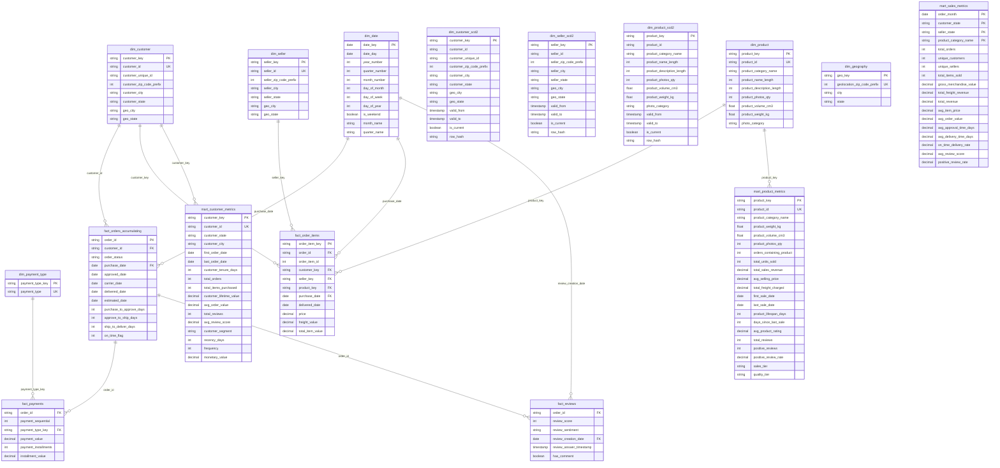

# Brazilian E-Commerce Data Warehouse - Entity Relationship Diagram

## Dimensional Model Architecture

```mermaid
erDiagram
    %% ==========================================
    %% DIMENSION TABLES (Type 1 SCD)
    %% ==========================================
    
    dim_customer {
        string customer_key PK
        string customer_id UK
        string customer_unique_id
        int customer_zip_code_prefix
        string customer_city
        string customer_state
        string geo_city
        string geo_state
    }

    dim_seller {
        string seller_key PK
        string seller_id UK
        int seller_zip_code_prefix
        string seller_city
        string seller_state
        string geo_city
        string geo_state
    }

    dim_product {
        string product_key PK
        string product_id UK
        string product_category_name
        int product_name_length
        int product_description_length
        int product_photos_qty
        float product_volume_cm3
        float product_weight_kg
        string photo_category
    }

    %% ==========================================
    %% DIMENSION TABLES (Type 2 SCD)
    %% ==========================================

    dim_customer_scd2 {
        string customer_key PK
        string customer_id
        string customer_unique_id
        int customer_zip_code_prefix
        string customer_city
        string customer_state
        string geo_city
        string geo_state
        timestamp valid_from
        timestamp valid_to
        boolean is_current
        string row_hash
    }

    dim_seller_scd2 {
        string seller_key PK
        string seller_id
        int seller_zip_code_prefix
        string seller_city
        string seller_state
        string geo_city
        string geo_state
        timestamp valid_from
        timestamp valid_to
        boolean is_current
        string row_hash
    }

    dim_product_scd2 {
        string product_key PK
        string product_id
        string product_category_name
        int product_name_length
        int product_description_length
        int product_photos_qty
        float product_volume_cm3
        float product_weight_kg
        string photo_category
        timestamp valid_from
        timestamp valid_to
        boolean is_current
        string row_hash
    }

    %% ==========================================
    %% SHARED DIMENSIONS
    %% ==========================================

    dim_date {
        date date_key PK
        date date_day
        int year_number
        int quarter_number
        int month_number
        int day_of_month
        int day_of_week
        int day_of_year
        boolean is_weekend
        string month_name
        string quarter_name
    }

    dim_geography {
        string geo_key PK
        int geolocation_zip_code_prefix UK
        string city
        string state
    }

    dim_payment_type {
        string payment_type_key PK
        string payment_type UK
    }

    %% ==========================================
    %% FACT TABLES
    %% ==========================================

    fact_orders_accumulating {
        string order_id PK
        string customer_id FK
        string order_status
        date purchase_date FK
        date approved_date
        date carrier_date
        date delivered_date
        date estimated_date
        int purchase_to_approve_days
        int approve_to_ship_days
        int ship_to_deliver_days
        int on_time_flag
    }

    fact_order_items {
        string order_item_key PK
        string order_id FK
        int order_item_id
        string customer_key FK
        string seller_key FK
        string product_key FK
        date purchase_date FK
        date delivered_date
        decimal price
        decimal freight_value
        decimal total_item_value
    }

    fact_payments {
        string order_id FK
        int payment_sequential
        string payment_type_key FK
        decimal payment_value
        int payment_installments
        decimal installment_value
    }

    fact_reviews {
        string order_id FK
        int review_score
        string review_sentiment
        date review_creation_date FK
        timestamp review_answer_timestamp
        boolean has_comment
    }

    %% ==========================================
    %% BUSINESS METRICS MARTS
    %% ==========================================

    mart_sales_metrics {
        date order_month PK
        string customer_state PK
        string seller_state PK
        string product_category_name PK
        int total_orders
        int unique_customers
        int unique_sellers
        int total_items_sold
        decimal gross_merchandise_value
        decimal total_freight_revenue
        decimal total_revenue
        decimal avg_item_price
        decimal avg_order_value
        decimal avg_approval_time_days
        decimal avg_delivery_time_days
        decimal on_time_delivery_rate
        decimal avg_review_score
        decimal positive_review_rate
    }

    mart_customer_metrics {
        string customer_key PK
        string customer_id UK
        string customer_state
        string customer_city
        date first_order_date
        date last_order_date
        int customer_tenure_days
        int total_orders
        int total_items_purchased
        decimal customer_lifetime_value
        decimal avg_order_value
        int total_reviews
        decimal avg_review_score
        string customer_segment
        int recency_days
        int frequency
        decimal monetary_value
    }

    mart_product_metrics {
        string product_key PK
        string product_id UK
        string product_category_name
        float product_weight_kg
        float product_volume_cm3
        int product_photos_qty
        int orders_containing_product
        int total_units_sold
        decimal total_sales_revenue
        decimal avg_selling_price
        decimal total_freight_charged
        date first_sale_date
        date last_sale_date
        int product_lifespan_days
        int days_since_last_sale
        decimal avg_product_rating
        int total_reviews
        int positive_reviews
        decimal positive_review_rate
        string sales_tier
        string quality_tier
    }

    %% ==========================================
    %% STAR SCHEMA RELATIONSHIPS
    %% ==========================================

    %% Fact to Dimension Relationships
    dim_customer ||--o{ fact_orders_accumulating : customer_id
    dim_date ||--o{ fact_orders_accumulating : purchase_date
    
    dim_customer ||--o{ fact_order_items : customer_key
    dim_seller ||--o{ fact_order_items : seller_key
    dim_product ||--o{ fact_order_items : product_key
    dim_date ||--o{ fact_order_items : purchase_date
    
    dim_payment_type ||--o{ fact_payments : payment_type_key
    fact_orders_accumulating ||--o{ fact_payments : order_id
    
    fact_orders_accumulating ||--o{ fact_reviews : order_id
    dim_date ||--o{ fact_reviews : review_creation_date
    
    %% Metrics Mart Relationships
    dim_customer ||--o{ mart_customer_metrics : customer_key
    dim_product ||--o{ mart_product_metrics : product_key
```
