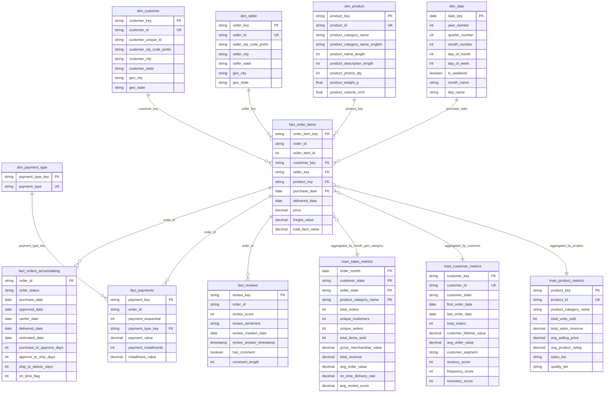

# Brazilian E-Commerce Data Warehouse - Entity Relationship Diagram

## Why Dimensional Modeling?

We chose **Kimball dimensional modeling** (star schema) for this data warehouse because:

1. **Query Performance**: Denormalized structure reduces complex joins, enabling fast analytical queries for dashboards and reports
2. **Business User Friendly**: Dimensions represent business entities (customers, products, sellers) that business users understand intuitively
3. **Scalability**: Conformed dimensions and incremental fact loading support growing data volumes efficiently
4. **Flexibility**: Supports slice-and-dice analysis across multiple business dimensions (time, geography, product categories)
5. **Historical Tracking**: Hybrid SCD approach - Type 1 for current state (fast), Type 2 snapshots for historical analysis (accurate)

## Dimensional Model - Star Schema

