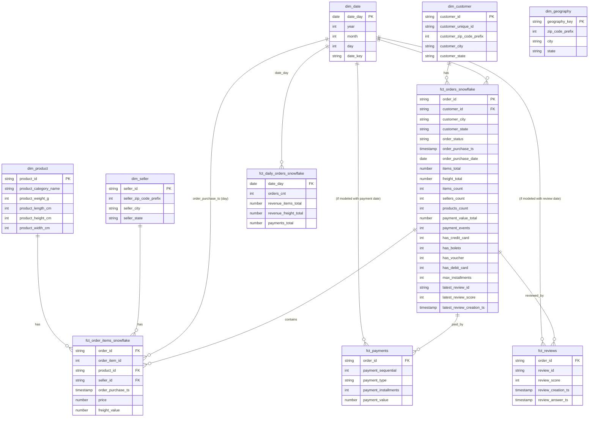

```mermaid

erDiagram
    %% Dimensions
    dim_customer {
        string customer_id PK
        string customer_unique_id
        int customer_zip_code_prefix
        string customer_city
        string customer_state
    }

    dim_seller {
        string seller_id PK
        int seller_zip_code_prefix
        string seller_city
        string seller_state
    }

    dim_product {
        string product_id PK
        string product_category_name
        int product_weight_g
        int product_length_cm
        int product_height_cm
        int product_width_cm
    }

    dim_date {
        date date_day PK
        int year
        int month
        int day
        string date_key
    }

    dim_geography {
        string geography_key PK
        int zip_code_prefix
        string city
        string state
    }

    %% Facts (Snowflake-optimized variants)
    fct_orders_snowflake {
        string order_id PK
        string customer_id FK
        string customer_city
        string customer_state
        string order_status
        timestamp order_purchase_ts
        date order_purchase_date
        number items_total
        number freight_total
        int items_count
        int sellers_count
        int products_count
        number payment_value_total
        int payment_events
        int has_credit_card
        int has_boleto
        int has_voucher
        int has_debit_card
        int max_installments
        string latest_review_id
        int latest_review_score
        timestamp latest_review_creation_ts
    }

    fct_order_items_snowflake {
        string order_id FK
        int order_item_id
        string product_id FK
        string seller_id FK
        timestamp order_purchase_ts
        number price
        number freight_value
    }

    fct_payments {
        string order_id FK
        int payment_sequential
        string payment_type
        int payment_installments
        number payment_value
    }

    fct_reviews {
        string order_id FK
        string review_id
        int review_score
        timestamp review_creation_ts
        timestamp review_answer_ts
    }

    fct_daily_orders_snowflake {
        date date_day FK
        int orders_cnt
        number revenue_items_total
        number revenue_freight_total
        number payments_total
    }

    %% Relationships
    dim_customer ||--o{ fct_orders_snowflake : has
    dim_product  ||--o{ fct_order_items_snowflake : has
    dim_seller   ||--o{ fct_order_items_snowflake : has
    dim_date     ||--o{ fct_orders_snowflake : "order_purchase_date"
    dim_date     ||--o{ fct_order_items_snowflake : "order_purchase_ts (day)"
    dim_date     ||--o{ fct_payments : "(if modeled with payment date)"
    dim_date     ||--o{ fct_reviews  : "(if modeled with review date)"
    dim_date     ||--o{ fct_daily_orders_snowflake : "date_day"

    fct_orders_snowflake ||--o{ fct_order_items_snowflake : contains
    fct_orders_snowflake ||--o{ fct_payments : paid_by
    fct_orders_snowflake ||--o{ fct_reviews : reviewed_by
```