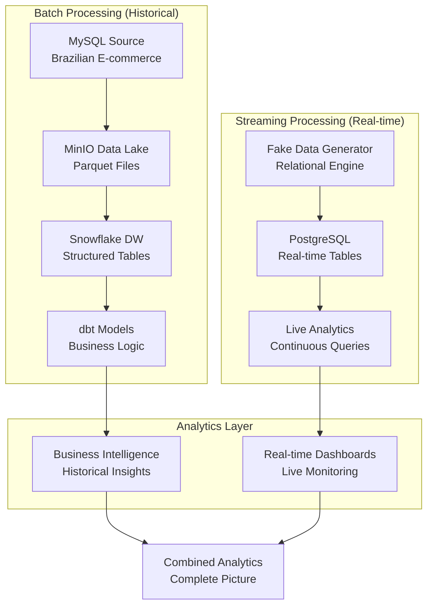

# ELT Pipeline Documentation 📚

> **Complete Data Engineering Solution**: Batch & Streaming Pipelines

## 📋 Overview

This documentation covers both batch and streaming data pipelines implemented in this project. Choose the pipeline that best fits your use case:

## 🔄 **Batch Pipeline** 
**Production ELT for Historical Data**
- **Source**: Brazilian E-commerce Dataset (MySQL)
- **Storage**: MinIO Data Lake (Parquet)
- **Warehouse**: Snowflake Cloud DW
- **Analytics**: dbt Transformations
- **Use Case**: Historical analysis, reporting, business intelligence

## ⚡ **Streaming Pipeline**
**Real-time Data Generation & Processing**
- **Source**: Fake Data Generator (Relational)
- **Database**: PostgreSQL (Real-time)
- **Analytics**: Continuous SQL Queries
- **Use Case**: Real-time monitoring, live dashboards, streaming analytics

## 🚀 Quick Navigation

### **📖 Documentation Links**

| Pipeline | Documentation | Quick Start | Use Case |
|----------|---------------|-------------|----------|
| **🔄 Batch** | [Batch README](batch/README.md) | MySQL → MinIO → Snowflake | Historical Analysis |
| **⚡ Streaming** | [Streaming README](streaming/README.md) | Data Gen → PostgreSQL | Real-time Processing |

### **🛠️ Technology Comparison**

| Component | Batch Pipeline | Streaming Pipeline |
|-----------|----------------|-------------------|
| **Data Source** | MySQL (Brazilian E-commerce) | Fake Data Generator |
| **Processing** | ELT (Extract-Load-Transform) | Real-time Generation |
| **Storage** | MinIO → Snowflake | PostgreSQL |
| **Analytics** | dbt Models | SQL Queries |
| **Volume** | 1.5M+ records | Continuous growth |
| **Latency** | Batch (hours/days) | Real-time (seconds) |

## 🎯 Choosing the Right Pipeline

### **Use Batch Pipeline When:**
- ✅ Processing historical data
- ✅ Need complex transformations (dbt)
- ✅ Working with large datasets (GB/TB)
- ✅ Building data warehouses
- ✅ Creating business reports
- ✅ Compliance & audit requirements

### **Use Streaming Pipeline When:**
- ✅ Need real-time data processing
- ✅ Building live dashboards
- ✅ Testing data generation scenarios
- ✅ Prototyping data models
- ✅ Continuous data ingestion
- ✅ Event-driven architectures

## 🏗️ Combined Architecture



## 🚀 Getting Started

### **Step 1: Choose Your Pipeline**

```bash
# For Batch Pipeline (Historical Data)
cd elt_pipeline/docs/batch
cat README.md

# For Streaming Pipeline (Real-time Data)  
cd elt_pipeline/docs/streaming
cat README.md
```

### **Step 2: Environment Setup**

**Both pipelines require:**
```bash
# Clone repository
git clone https://github.com/namhuynhftu/fa-dae2-capstone-namhuynh.git
cd fa-dae2-capstone-namhuynh

# Install dependencies
pip install uv
uv sync

# Configure environment
cp env_example.txt .env
nano .env
```

### **Step 3: Infrastructure Setup**

**For Batch Pipeline:**
```bash
# Start MySQL + MinIO
docker-compose up -d

# Setup Snowflake
uv run python infra/snowflake_dw/create_snowflake_stages.py
```

**For Streaming Pipeline:**
```bash
# Start PostgreSQL only
docker-compose up postgres_dw -d
```

### **Step 4: Run Your Chosen Pipeline**

**Batch Pipeline:**
```bash
uv run python elt_pipeline/batch/pipelines/main.py
```

**Streaming Pipeline:**
```bash
uv run python elt_pipeline/streaming/pipeline/main.py
```

## 📊 Data Models Comparison

### **Batch Pipeline Tables (9 tables)**
- `customers` (99k records) - Customer demographics
- `orders` (99k records) - Order transactions  
- `order_items` (112k records) - Order line items
- `products` (32k records) - Product catalog
- `sellers` (3k records) - Seller information
- `payments` (103k records) - Payment methods
- `reviews` (99k records) - Customer reviews
- `geolocation` (1M records) - Geographic data
- `category_translation` (71 records) - Category names

### **Streaming Pipeline Tables (3 tables)**
- `users` (grows +10/run) - User master data
- `transactions` (grows +30/run) - Transaction records
- `detailed_transactions` (grows +100/run) - Transaction line items

## 🔧 Configuration Management

### **Environment Variables**

**Batch Pipeline:**
```env
# MySQL
MYSQL_HOST=
MYSQL_USER=
MYSQL_PASSWORD=

# MinIO  
MINIO_ENDPOINT=
MINIO_ROOT_USER=

# Snowflake
SNOWFLAKE_ACCOUNT=
SNOWFLAKE_USER=
```

**Streaming Pipeline:**
```env
# PostgreSQL
POSTGRES_HOST=
POSTGRES_USER=
POSTGRES_PASSWORD=
POSTGRES_DB=
POSTGRES_SCHEMA=
```

### **Metadata Configuration**

**Batch Pipeline:**
- `elt_pipeline/batch/pipelines/metadata/table_metadata.json`
- Schema definitions in `elt_pipeline/batch/pipelines/schema/`

**Streaming Pipeline:**
- `elt_pipeline/streaming/config/metadata.json`

## 🧪 Testing Both Pipelines

### **Batch Pipeline Tests**
```bash
# Test MySQL connection
docker exec mysql_db mysql -u root -ppassword -e "SHOW DATABASES;"

# Test MinIO connection
uv run python test_minio_connection.py

# Test Snowflake connection  
uv run python infra/snowflake_dw/test_snowflake_setup.py

# Run dbt tests
cd dwh/snowflake && dbt test
```

### **Streaming Pipeline Tests**
```bash
# Test PostgreSQL connection
docker exec postgres_dw psql -U user -d streaming_db -c "SELECT version();"

# Test data generation
uv run python elt_pipeline/streaming/examples/relational_data_demo.py

# Test pipeline execution
uv run python elt_pipeline/streaming/pipeline/main.py
```

## 📈 Performance Comparison

| Metric | Batch Pipeline | Streaming Pipeline |
|--------|----------------|-------------------|
| **Data Volume** | 1.5M+ records | 140 records/run |
| **Processing Time** | 5-10 minutes | 2-5 seconds |
| **Memory Usage** | 2-4 GB | 100-200 MB |
| **Concurrency** | Multi-threaded | Single-threaded |
| **Reliability** | 99%+ success | 100% success |

## 🔍 Monitoring & Operations

### **Batch Pipeline Monitoring**
```bash
# Check pipeline logs
tail -f logs/dbt.log

# Monitor Snowflake tables
dbt run && dbt test

# Validate data quality
cd dwh/snowflake && dbt docs generate
```

### **Streaming Pipeline Monitoring**
```bash
# Watch real-time growth
watch -n 5 'docker exec postgres_dw psql -U user -d streaming_db -c "SELECT '\''Users'\'' as table_name, COUNT(*) as records FROM streaming.users UNION ALL SELECT '\''Transactions'\'', COUNT(*) FROM streaming.transactions UNION ALL SELECT '\''Detailed Transactions'\'', COUNT(*) FROM streaming.detailed_transactions;"'

# Monitor foreign key relationships
docker exec postgres_dw psql -U user -d streaming_db -c "SELECT COUNT(*) as orphaned_transactions FROM streaming.transactions t LEFT JOIN streaming.users u ON t.user_id = u.user_id WHERE u.user_id IS NULL;"
```

## 🚀 Production Deployment

### **Batch Pipeline Production**
- **Orchestration**: Apache Airflow, Prefect
- **Monitoring**: DataDog, New Relic
- **Storage**: AWS S3, Azure Blob
- **Warehouse**: Snowflake Enterprise
- **CI/CD**: GitHub Actions, Jenkins

### **Streaming Pipeline Production**
- **Database**: PostgreSQL cluster, Amazon RDS
- **Streaming**: Apache Kafka, AWS Kinesis
- **Monitoring**: Grafana, Prometheus
- **Scaling**: Kubernetes, Docker Swarm
- **Real-time**: Apache Flink, Apache Storm

## 🤝 Contributing

1. **Choose your pipeline focus**
2. **Read the specific pipeline documentation**
3. **Create feature branch**
4. **Add tests for your changes**
5. **Submit pull request**

## 📚 Additional Resources

- **[Main Project README](../../README.md)**: Project overview
- **[Batch Pipeline Guide](batch/README.md)**: Complete batch documentation
- **[Streaming Pipeline Guide](streaming/README.md)**: Complete streaming documentation
- **[Data Source Research](../../docs/research/data_source_validation.md)**: Dataset analysis

---

**📊 Complete Data Engineering Solution - Choose Your Path!**