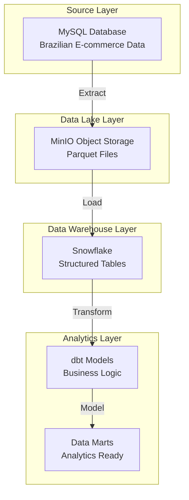

# Batch Pipeline Documentation 🔄

> **Production ELT Pipeline**: MySQL → MinIO → Snowflake → dbt

## 📋 Overview

The batch pipeline processes Brazilian e-commerce data through a complete ELT workflow, moving data from MySQL source through MinIO data lake to Snowflake data warehouse, with dbt for transformations.

## 🏗️ Architecture



## 🚀 Quick Start Guide

### Prerequisites
- ✅ Python 3.11+
- ✅ Docker & Docker Compose
- ✅ Snowflake Account
- ✅ UV Package Manager

### Step 1: Environment Setup

```bash
# Clone repository
git clone https://github.com/namhuynhftu/fa-dae2-capstone-namhuynh.git
cd fa-dae2-capstone-namhuynh

# Install dependencies
pip install uv
uv sync
```

### Step 2: Configuration

```bash
# Copy environment template
cp env_example.txt .env

# Edit .env with your credentials
nano .env
```

**Required Environment Variables:**
```env
# MySQL Configuration
MYSQL_HOST=
MYSQL_PORT=
MYSQL_USER=
MYSQL_PASSWORD=
MYSQL_DATABASE=

# MinIO Configuration
MINIO_ENDPOINT=
MINIO_ROOT_USER=
MINIO_ROOT_PASSWORD=
MINIO_BUCKET=

# Snowflake Configuration
SNOWFLAKE_ACCOUNT=
SNOWFLAKE_USER=
SNOWFLAKE_PASSWORD=
SNOWFLAKE_WAREHOUSE=
SNOWFLAKE_DATABASE=
SNOWFLAKE_ROLE=
```

### Step 3: Infrastructure Setup

```bash
# Start MySQL and MinIO containers
docker-compose up -d

# Wait for containers to be ready
sleep 30

# Verify MySQL container
docker exec mysql_db mysql -u root -ppassword -e "SHOW DATABASES;"

# Verify MinIO container
curl -f http://localhost:9000/minio/health/live
```

### Step 4: Snowflake Setup

```bash
# Create Snowflake stages and tables
uv run python infra/snowflake_dw/create_snowflake_stages.py

# Test Snowflake connection
uv run python infra/snowflake_dw/test_snowflake_setup.py
```

### Step 5: Run the Pipeline

```bash
# Execute complete batch pipeline
uv run python elt_pipeline/batch/pipelines/main.py

# Monitor progress (check logs)
tail -f logs/dbt.log
```

### Step 6: dbt Transformations

```bash
# Navigate to dbt project
cd dwh/snowflake

# Test dbt connection
dbt debug

# Install dbt packages
dbt deps

# Run transformations
dbt run

# Run tests
dbt test

# Generate documentation
dbt docs generate
dbt docs serve
```

## 📊 Data Flow Details

### **Phase 1: Extract (MySQL → MinIO)**
- **Source**: 9 tables with ~1.5M+ records
- **Format**: CSV → Parquet (compressed)
- **Storage**: MinIO object storage (S3-compatible)
- **Features**: Incremental loading, schema validation

### **Phase 2: Load (MinIO → Snowflake)**
- **Method**: COPY commands (production) / pandas (development)
- **Optimization**: Parallel loading, type conversion
- **Monitoring**: Progress tracking, error handling

### **Phase 3: Transform (dbt)**
- **Models**: Staging → Intermediate → Mart
- **Tests**: Data quality validation
- **Documentation**: Auto-generated lineage

## 🔧 Configuration Files

### **Table Metadata**
- **Location**: `elt_pipeline/batch/pipelines/metadata/table_metadata.json`
- **Purpose**: Defines extraction strategies and schemas

```json
{
  "customers": {
    "load_strategy": "full",
    "description": "Customer demographics and location data"
  },
  "orders": {
    "load_strategy": "incremental",
    "incremental_column": "order_purchase_timestamp",
    "description": "Order transactions with timestamps"
  }
}
```

### **Schema Definitions**
- **Location**: `elt_pipeline/batch/pipelines/schema/`
- **Purpose**: JSON schema validation for each table

## 🔍 Monitoring & Troubleshooting

### **Pipeline Execution Logs**
```bash
# View real-time logs
tail -f logs/dbt.log

# Check specific operation logs
grep "ERROR" logs/dbt.log
grep "SUCCESS" logs/dbt.log
```

### **Data Validation**
```bash
# Test data quality in Snowflake
uv run python infra/snowflake_dw/test_snowflake_setup.py

# Validate MinIO storage
uv run python test_minio_connection.py

# Check dbt models
cd dwh/snowflake && dbt test
```

### **Common Issues & Solutions**

| Issue | Symptom | Solution |
|-------|---------|----------|
| **MySQL Connection** | `Can't connect to MySQL server` | Check container status: `docker-compose ps` |
| **MinIO Access** | `Access Denied` | Verify credentials in `.env` file |
| **Snowflake Auth** | `Authentication failed` | Check account URL format |
| **dbt Compilation** | `Compilation Error` | Run `dbt deps` and verify profiles.yml |

## 📈 Performance Optimization

### **Loading Strategies**
- **Full Load**: Complete table refresh (small, reference tables)
- **Incremental Load**: Delta updates using timestamps
- **Hybrid Mode**: Automatic fallback for compatibility

### **Best Practices**
1. **Chunked Processing**: Process large tables in batches
2. **Parallel Execution**: Multi-threaded operations
3. **Connection Pooling**: Efficient database connections
4. **Error Recovery**: Automatic retry mechanisms

## 🧪 Testing

### **Unit Tests**
```bash
# Run all tests
uv run pytest elt_pipeline/batch/tests/

# Test specific components
uv run pytest elt_pipeline/batch/tests/test_mysql_loader.py
```

### **Integration Tests**
```bash
# Test full pipeline
uv run python elt_pipeline/batch/pipelines/main.py --test-mode

# Validate data integrity
cd dwh/snowflake && dbt test
```

## 📚 Additional Resources

- **[Data Source Research](../../docs/research/data_source_validation.md)**: Dataset analysis
- **[dbt Documentation](../../dwh/snowflake/)**: Transformation details
- **[API Reference](api-reference.md)**: Code documentation

## 🔄 CI/CD Integration

### **GitHub Actions Example**
```yaml
name: Batch Pipeline
on:
  schedule:
    - cron: '0 2 * * *'  # Daily at 2 AM
  
jobs:
  batch-pipeline:
    runs-on: ubuntu-latest
    steps:
      - uses: actions/checkout@v3
      - name: Setup Python
        uses: actions/setup-python@v4
        with:
          python-version: '3.11'
      - name: Install dependencies
        run: |
          pip install uv
          uv sync
      - name: Run pipeline
        run: uv run python elt_pipeline/batch/pipelines/main.py
```

## 🚀 Production Deployment

### **Environment Considerations**
- **Development**: Local Docker containers
- **Staging**: Cloud MinIO + Snowflake trial
- **Production**: Enterprise Snowflake + S3

### **Scaling Options**
- **Orchestration**: Apache Airflow, Prefect
- **Monitoring**: DataDog, New Relic
- **Alerting**: Slack, PagerDuty integration

---

**📊 Ready to process millions of records with confidence!**