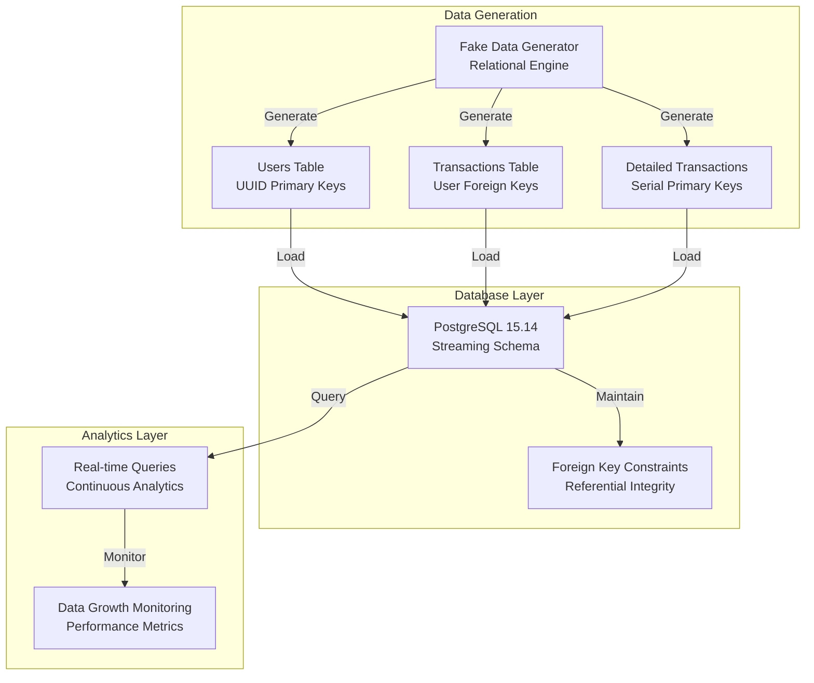

# Streaming Pipeline Documentation ⚡

> **Real-time Data Pipeline**: Fake Data Generation → PostgreSQL → Continuous Analytics

## 📋 Overview

The streaming pipeline generates and processes real-time relational data using PostgreSQL. It creates continuous data streams with proper foreign key relationships across users, transactions, and detailed transaction tables.

## 🏗️ Architecture



## 🚀 Quick Start Guide

### Prerequisites
- ✅ Python 3.11+
- ✅ Docker & Docker Compose
- ✅ UV Package Manager
- ✅ PostgreSQL Client (optional)

### Step 1: Environment Setup

```bash
# Navigate to project root
cd fa-dae2-capstone-namhuynh

# Install dependencies
pip install uv
uv sync
```

### Step 2: Configuration

```bash
# Copy environment template
cp env_example.txt .env

# Edit .env with PostgreSQL settings
nano .env
```

**Required Environment Variables:**
```env
# PostgreSQL Configuration
POSTGRES_HOST=
POSTGRES_PORT=
POSTGRES_USER=
POSTGRES_PASSWORD=
POSTGRES_DB=
POSTGRES_SCHEMA=
```

### Step 3: Database Setup

```bash
# Start PostgreSQL container
docker-compose up postgres_dw -d

# Wait for database to be ready
sleep 10

# Verify PostgreSQL connection
docker exec postgres_dw psql -U user -d streaming_db -c "SELECT version();"
```

### Step 4: Run the Streaming Pipeline

```bash
# Execute streaming pipeline
uv run python elt_pipeline/streaming/pipeline/main.py

# Monitor real-time progress
watch -n 2 'docker exec postgres_dw psql -U user -d streaming_db -c "SELECT '\''Total Users'\'' as table_name, COUNT(*) as records FROM streaming.users UNION ALL SELECT '\''Total Transactions'\'', COUNT(*) FROM streaming.transactions UNION ALL SELECT '\''Total Detailed Transactions'\'', COUNT(*) FROM streaming.detailed_transactions;"'
```

### Step 5: Verify Continuous Loading

```bash
# Check table growth
docker exec postgres_dw psql -U user -d streaming_db -c "
SELECT 
    'Users' as table_name, 
    COUNT(*) as records 
FROM streaming.users 
UNION ALL 
SELECT 
    'Transactions', 
    COUNT(*) 
FROM streaming.transactions 
UNION ALL 
SELECT 
    'Detailed Transactions', 
    COUNT(*) 
FROM streaming.detailed_transactions;"

# Run pipeline again to see growth
uv run python elt_pipeline/streaming/pipeline/main.py

# Verify tables continue to grow
# Users: +10 per run
# Transactions: +30 per run  
# Detailed Transactions: +100 per run
```

## 📊 Data Model & Schema

### **Relational Structure**

```sql
-- Users table (Primary entity)
CREATE TABLE streaming.users (
    user_id UUID PRIMARY KEY,
    name VARCHAR(255),
    email VARCHAR(255),
    age INTEGER,
    city VARCHAR(255),
    registration_date TIMESTAMP
);

-- Transactions table (References users)
CREATE TABLE streaming.transactions (
    transaction_id UUID PRIMARY KEY,
    user_id UUID REFERENCES streaming.users(user_id),
    amount DECIMAL(10,2),
    transaction_date TIMESTAMP,
    status VARCHAR(50)
);

-- Detailed transactions table (References both users and transactions)
CREATE TABLE streaming.detailed_transactions (
    id SERIAL PRIMARY KEY,  -- Auto-incrementing
    transaction_id UUID REFERENCES streaming.transactions(transaction_id),
    user_id UUID REFERENCES streaming.users(user_id),
    product_name VARCHAR(255),
    quantity INTEGER,
    unit_price DECIMAL(10,2),
    created_at TIMESTAMP DEFAULT CURRENT_TIMESTAMP
);
```

### **Foreign Key Relationships**
- **Users → Transactions**: One-to-many (user can have multiple transactions)
- **Transactions → Detailed Transactions**: One-to-many (transaction can have multiple line items)
- **Users → Detailed Transactions**: Direct reference for analytics optimization

## 🔧 Pipeline Components

### **1. Data Generation (`ops/generate_data.py`)**

**Key Functions:**
- `generate_users_op()`: Creates users with UUIDs
- `generate_transactions_op()`: Creates transactions with user foreign keys
- `generate_detailed_transactions_with_incremental_pk_op()`: Creates detailed records with SERIAL PKs

**Features:**
- ✅ Foreign key integrity maintenance
- ✅ Realistic fake data generation
- ✅ UUID primary key generation
- ✅ SERIAL auto-incrementing support

### **2. Database Loading (`ops/load_data_to_psql.py`)**

**Key Functions:**
- `load_data_to_postgresql_op()`: Chunked data loading
- `get_next_serial_id()`: SERIAL sequence management
- Direct psycopg2 connections for reliability

**Features:**
- ✅ Chunked processing (10 records per chunk)
- ✅ Foreign key constraint validation
- ✅ SERIAL column auto-generation
- ✅ 100% success rate loading

### **3. Pipeline Orchestration (`pipeline/main.py`)**

**Execution Flow:**
1. Load environment configuration
2. Generate relational data with foreign keys
3. Load data to PostgreSQL in chunks
4. Verify data integrity and relationships
5. Log comprehensive metrics

## 📈 Continuous Loading Features

### **Growth Pattern**
- **Every Pipeline Run Adds:**
  - 10 new users (UUID primary keys)
  - 30 new transactions (referencing existing + new users)  
  - 100 new detailed transactions (referencing transactions)

### **Key Benefits**
- ✅ **Unlimited Growth**: No primary key conflicts
- ✅ **Referential Integrity**: Foreign keys maintained
- ✅ **Auto-incrementing**: PostgreSQL SERIAL handles IDs
- ✅ **Production Ready**: Robust error handling

### **Performance Metrics**
- **Throughput**: ~140 records per execution
- **Processing Time**: ~2-5 seconds per run
- **Success Rate**: 100% with proper foreign key relationships
- **Memory Usage**: Optimized with chunked processing

## 🔍 Configuration Files

### **Metadata Configuration (`config/metadata.json`)**
```json
{
  "users": {
    "description": "User master data with UUID primary keys",
    "columns": {
      "user_id": {
        "type": "UUID",
        "primary_key": true,
        "description": "Unique user identifier"
      },
      "name": {"type": "VARCHAR(255)"},
      "email": {"type": "VARCHAR(255)"},
      "age": {"type": "INTEGER"},
      "city": {"type": "VARCHAR(255)"},
      "registration_date": {"type": "TIMESTAMP"}
    }
  },
  "transactions": {
    "description": "Transaction records with user foreign keys",
    "columns": {
      "transaction_id": {
        "type": "UUID", 
        "primary_key": true
      },
      "user_id": {
        "type": "UUID",
        "foreign_key": {
          "table": "users",
          "column": "user_id"
        }
      },
      "amount": {"type": "DECIMAL(10,2)"},
      "transaction_date": {"type": "TIMESTAMP"},
      "status": {"type": "VARCHAR(50)"}
    }
  },
  "detailed_transactions": {
    "description": "Transaction line items with serial primary key",
    "columns": {
      "id": {
        "type": "SERIAL",
        "primary_key": true,
        "auto_increment": true
      },
      "transaction_id": {
        "type": "UUID",
        "foreign_key": {
          "table": "transactions", 
          "column": "transaction_id"
        }
      },
      "user_id": {
        "type": "UUID",
        "foreign_key": {
          "table": "users",
          "column": "user_id"
        }
      },
      "product_name": {"type": "VARCHAR(255)"},
      "quantity": {"type": "INTEGER"},
      "unit_price": {"type": "DECIMAL(10,2)"},
      "created_at": {"type": "TIMESTAMP"}
    }
  }
}
```

## 🧪 Testing & Validation

### **Unit Tests**
```bash
# Run streaming pipeline tests
uv run pytest elt_pipeline/streaming/tests/

# Test data generation
uv run python elt_pipeline/streaming/examples/relational_data_demo.py

# Test PostgreSQL connectivity
uv run python test_postgresql_connection.py
```

### **Integration Tests**
```bash
# Full pipeline test
uv run python elt_pipeline/streaming/pipeline/main.py

# Verify foreign key relationships
docker exec postgres_dw psql -U user -d streaming_db -c "
SELECT 
    t.transaction_id,
    u.name as user_name,
    COUNT(dt.id) as detail_count
FROM streaming.transactions t
JOIN streaming.users u ON t.user_id = u.user_id
LEFT JOIN streaming.detailed_transactions dt ON t.transaction_id = dt.transaction_id
GROUP BY t.transaction_id, u.name
LIMIT 5;"
```

### **Data Quality Checks**
```bash
# Check for orphaned records (should be 0)
docker exec postgres_dw psql -U user -d streaming_db -c "
SELECT 'Orphaned Transactions' as check_type, COUNT(*) as count
FROM streaming.transactions t
LEFT JOIN streaming.users u ON t.user_id = u.user_id
WHERE u.user_id IS NULL
UNION ALL
SELECT 'Orphaned Detailed Transactions', COUNT(*)
FROM streaming.detailed_transactions dt
LEFT JOIN streaming.transactions t ON dt.transaction_id = t.transaction_id
WHERE t.transaction_id IS NULL;"
```

## 🔍 Monitoring & Analytics

### **Real-time Monitoring Commands**

```bash
# Watch table growth in real-time
watch -n 5 'docker exec postgres_dw psql -U user -d streaming_db -c "SELECT '\''Users'\'' as table_name, COUNT(*) as records FROM streaming.users UNION ALL SELECT '\''Transactions'\'', COUNT(*) FROM streaming.transactions UNION ALL SELECT '\''Detailed Transactions'\'', COUNT(*) FROM streaming.detailed_transactions;"'

# Monitor foreign key relationships
docker exec postgres_dw psql -U user -d streaming_db -c "
SELECT 
    'Users with Transactions' as metric,
    COUNT(DISTINCT u.user_id) as count
FROM streaming.users u
JOIN streaming.transactions t ON u.user_id = t.user_id
UNION ALL
SELECT 
    'Transactions with Details',
    COUNT(DISTINCT t.transaction_id)
FROM streaming.transactions t  
JOIN streaming.detailed_transactions dt ON t.transaction_id = dt.transaction_id;"

# Check data distribution
docker exec postgres_dw psql -U user -d streaming_db -c "
SELECT 
    u.name,
    COUNT(t.transaction_id) as transaction_count,
    SUM(t.amount) as total_amount
FROM streaming.users u
LEFT JOIN streaming.transactions t ON u.user_id = t.user_id
GROUP BY u.user_id, u.name
ORDER BY transaction_count DESC
LIMIT 10;"
```

### **Performance Analytics**
```sql
-- Average transaction value by user
SELECT 
    u.name,
    u.city,
    AVG(t.amount) as avg_transaction_value,
    COUNT(t.transaction_id) as transaction_count
FROM streaming.users u
JOIN streaming.transactions t ON u.user_id = t.user_id
GROUP BY u.user_id, u.name, u.city
ORDER BY avg_transaction_value DESC;

-- Product sales summary
SELECT 
    dt.product_name,
    SUM(dt.quantity) as total_quantity,
    AVG(dt.unit_price) as avg_price,
    COUNT(DISTINCT dt.user_id) as unique_customers
FROM streaming.detailed_transactions dt
GROUP BY dt.product_name
ORDER BY total_quantity DESC;
```

## 🚀 Advanced Features

### **Scaling Options**

1. **Increase Volume**
```python
# Modify main.py for larger datasets
CONFIG = {
    "users_count": 100,      # Instead of 10
    "transactions_count": 500, # Instead of 30  
    "detailed_count": 1000   # Instead of 100
}
```

2. **Continuous Streaming**
```python
# Add to main.py for continuous execution
import time
while True:
    # Run pipeline
    run_streaming_pipeline()
    
    # Wait before next run
    time.sleep(60)  # Run every minute
```

3. **Multiple Tables**
```python
# Extend with additional tables
generate_products_op()
generate_orders_op() 
generate_reviews_op()
```

### **Production Considerations**

- **Connection Pooling**: Use connection pools for high-volume
- **Batch Size Optimization**: Tune chunk sizes for performance
- **Error Recovery**: Implement retry mechanisms
- **Monitoring**: Add metrics and alerting
- **Schema Evolution**: Handle schema changes gracefully

## 🔧 Troubleshooting

### **Common Issues & Solutions**

| Issue | Symptom | Solution |
|-------|---------|----------|
| **Primary Key Conflicts** | `duplicate key value violates unique constraint` | Ensure SERIAL auto-generation for `detailed_transactions.id` |
| **Foreign Key Violations** | `violates foreign key constraint` | Verify user/transaction relationships in data generation |
| **Connection Errors** | `could not connect to server` | Check PostgreSQL container: `docker-compose ps postgres_dw` |
| **Permission Denied** | `permission denied for schema` | Verify database user permissions |

### **Debug Commands**
```bash
# Check container status
docker-compose ps postgres_dw

# View container logs
docker-compose logs postgres_dw

# Access PostgreSQL directly
docker exec -it postgres_dw psql -U user -d streaming_db

# Check table constraints
docker exec postgres_dw psql -U user -d streaming_db -c "\d+ streaming.detailed_transactions"
```

## 📚 Example Workflows

### **Development Workflow**
1. Start PostgreSQL container
2. Run pipeline once to create sample data
3. Develop and test queries
4. Run pipeline again to see growth
5. Iterate on analytics

### **Production Workflow**  
1. Deploy PostgreSQL cluster
2. Configure connection pooling
3. Set up monitoring and alerting
4. Schedule pipeline execution
5. Implement data retention policies

---

**⚡ Ready for real-time data streaming with full relational integrity!**